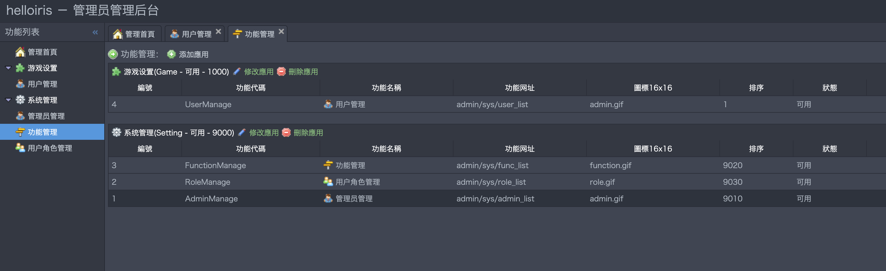

# iris-laravel-admin
a cms base on laravel and iris

怎么使用:

1- go get github.com/jqiris/iris-laravel-admin

2- cd GOPATH/src/github.com/jqiris/iris-laravel-admin

3- cd /app/Models/,将iris-laravel.sql导入mysql数据库

3- cd /hot & go build main.go & go run main.go,解决依赖关系，使用redis做缓存，支持热重启

4- config中定义常用的配置，以.env配置为主，包括常用的数据库配置

5-打开http://127.0.0.1:8081/admin，用户名-admin 密码-admin1登陆

屏幕截图：

优势

- 1-基于golang的iris框架，速度稳定，开发效率一点不逊于php
- 2-强类型语言，除逻辑问题外，语法问题在运行前都能找出
- 3-支持模板和代码热重启
- 4-可以定制支持长连接